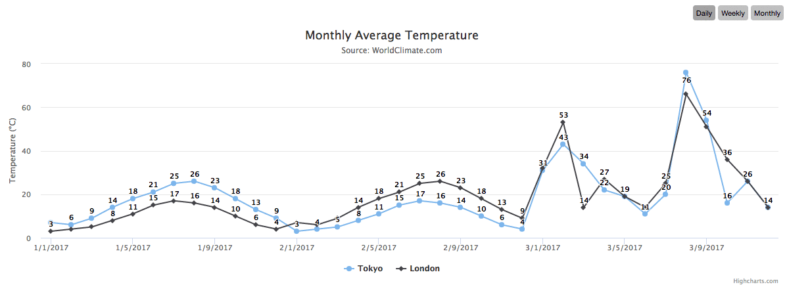

## Highcharts Date Range Grouping

This plugin is meant to help group data over a time domain. The raw dataset should be datapoints
broken down by day in order for the plugin to make weekly and monthly sums.

## Basic Usage
Chart Options: `dateRangeGrouping: true`

## TODO (v1.0.0)
- `/examples` should have an index file with some example charts against the dist file.
- Split JS files off from index and do reasonable includes
- Write better default styling
- Move all further TODOS into issues for patches
